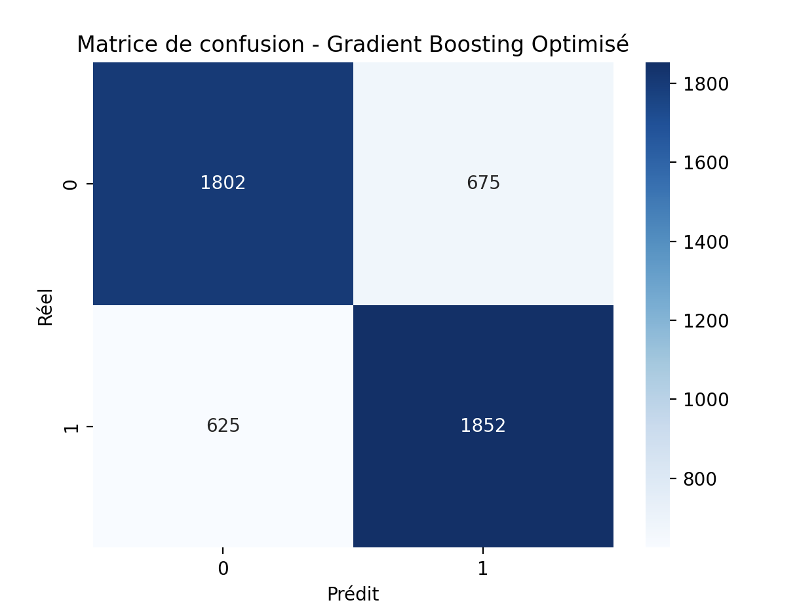

# README - Data Analysis of Clinical Notes

## Project Overview

This project focuses on structuring clinical notes from the MIMIC database using the Mistral API to extract patient and family medical history. By converting unstructured text into a structured format, we aim to identify key risk factors and correlations between pathologies. The analysis follows a structured pipeline: data extraction, visualization of medical trends through word clouds and statistical plots, and modeling to explore associations between conditions.

_🇫🇷 A French version of this document is available in the [README_FR.md](README_FR.md) file._

## Dataset
We utilized the **MIMIC-III database**, specifically the `NOTESEVENTS` table, to extract free-text clinical notes. The extracted data was structured using **Mistral API** to obtain:
- **Main Pathology**: The primary diagnosis.
- **Medical Personal History**: Significant prior conditions.
- **Medical Family History**: Conditions in close relatives.

Two batches of **100,000 patients** were processed, with structured JSON data stored as CSV files.

### ⚠️ Data Privacy & Security Measures

To comply with **MIMIC data-sharing regulations**, this repository does **NOT** include any raw MIMIC data. Instead, the following security measures have been implemented:

- **No real NOTEEVENTS data is included** instead, a demo dataset is provided, generated using 1_generate_demo_data_notes.py.

- **The PATIENTS.csv table is excluded from this repository**, however, PATIENTS_anonymized.csv is available, where SUBJECT_IDs have been **fully encrypted** to prevent any linkage to MIMIC.

- **The structured notes dataset (structured_notes.csv) has been highly transformed**, containing only the main pathology and medical history extracted via the Mistral API. The SUBJECT_IDs are also **anonymized.**

- **Files excluded from the repository:** NOTEEVENTS.csv, PATIENTS.csv, NOTEEVENTS_1.csv, NOTEEVENTS_2.csv, and structured_notes.csv (original versions with real IDs and real patient's notes).

## Project Structure
  ```
├── 1_data_structuration                 # Data structuring and preparation scripts
│   ├── data
│   │   ├── NOTEEVENTS_DEMO_1.csv        # Demo dataset for testing
│   │   ├── NOTEEVENTS_DEMO_2.csv        # Second subset of the demo dataset
│   │   ├── structured_notes_anonymized.csv # Structured notes (anonymized)
│   ├── 1_generate_demo_data_notes.py    # Script to generate fake NOTEEVENTS data
│   ├── 2_prepare_medical_notes.py       # Extraction of NOTEEVENTS subsets
│   ├── 3_medical_notes_structuring.py   # Mistral API processing (multithreading optimized)
│   ├── 4_anonymization.py               # SUBJECT_ID anonymization
├── 2_visualization                      # Visualization scripts and Streamlit app
│   └── visualization_data.py            # Word cloud and statistical plots
├── 3_modelisation                       # Machine learning and data modeling
│   ├── data
│   │   └── CAD_dataset.csv              # Dataset for CAD (Coronary Artery Disease) analysis
│   ├── data_preprocessing.py            # Data cleaning and preprocessing pipeline
│   ├── exploration.py                    # Exploratory Data Analysis (EDA)
│   ├── prediction.py                     # Machine learning model for hypothesis testing
├── MIMIC_data                           # Placeholder for restricted-access MIMIC data
│   ├── NOTEEVENTS_DEMO.csv              # Demo dataset (instead of real MIMIC data)
│   ├── PATIENTS_anonymized.csv          # Anonymized patient data
├── Images                               # Data visualizations
│   ├── app.png                          # Screenshot of Streamlit app
│   ├── distribution_key_risk_factors.png# Distribution of risk factors
│   ├── matrix_correlation.png           # Correlation heatmap
├── README.md                            # Project documentation
├── requirements.txt                     # Python dependencies
  ```
## Setup & Installation
### Requirements
- Python 3.8+
- Required libraries (install using pip):
  ```bash
  pip install -r requirements.txt
  ```

### Running the Pipeline
#### 1. Structuration

##### 1.1-2. Prepare Medical Notes 
   ```bash
   python 1_data_structuration/2_prepare_medical_notes.py
   ```
   - Extracts and splits ```NOTEEVENTS.csv``` into two subsets, each containing 100,000 rows.
   - Since the MIMIC III dataset is significantly large, structuration is performed only on a portion of the initial dataset.
   - As the real ```NOTEEVENTS.csv``` is not included in this repository due to MIMIC III data access restrictions, a demo dataset was generated using ```1_data_structuration/1_generate_demo_notes.py.``` This dataset replicates the structure and characteristics of the original data for illustrative and testing purposes.

   - ** ⚠️ Important Note: **
   You can fully test the structuration and preprocessing scripts using these demo files, without requiring access to the restricted dataset.

If you wish to run the structuration on the real MIMIC III data, you must first request access through PhysioNet by following these steps:

- Create an account on PhysioNet: https://physionet.org/login/
Complete the required credentialing process, including training on data privacy and security.
- Request access to the MIMIC-III dataset: https://physionet.org/content/mimiciii/
- Once approved, download the necessary tables (NOTEEVENTS.csv, PATIENTS.csv, etc.) and place them in the appropriate directory (MIMIC_data/).

##### 1.3 .Extract Data using Mistral API 
  ```bash
  python 1_data_structuration/4_medical_notes_structuring.py
   ```
   - Processes clinical notes using the Mistral API with multithreading to optimize processing time and handle large volumes of clinical text efficiently.
   - Saves the structured output as a CSV file in ```1_data_structuration/data/```, which is later used for analysis and modeling.

**⚠️ Important** : Before running the script, you must replace the API key placeholder in ```1_data_structuration/medical_notes_structuring.py``` with your own key:
   ```python 
  API_KEY = "XXXXXXXXXXXXXXXXXXXXXXXXX"  # Replace with your actual API key
   ```
   You can generate a free API key by signing up on the official Mistral AI platform
   👉 [Mistral API Platform ](https://mistral.ai/fr/news/la-plateforme)


##### 1.4 .Data Anonymization
  ```bash
   python 1_data_structuration/4_anonymization.py
 ```
-  ```SUBJECT_ID ``` encryption: Hashed with a secure, irreversible algorithm (e.g., SHA-256 truncated).
- Ensures no possible link to MIMIC’s original dataset.
- Consistency across files: Same anonymized  ```SUBJECT_ID ``` used in  ```PATIENTS_anonymized.csv ``` and  ```structured_notes_anonymized.csv ```, to ensure correspondance between the two tables for modelisation part.


#### 2. Visualize Data
   ```bash
   streamlit run 2_visualization/visualization.py
   ```
   - Launches the Streamlit app for data visualization. Also accessible by this link 👉 [mimic-disease-exploration.streamlit.app](https://mimic-disease-exploration.streamlit.app/)

   - Display word clouds and statistical plots in order to  identify frequent personal and family medical histories associated with specific pathologies. 

   

   
#### 3. Modeling
##### 3.1 Preprocessing Data
   ```bash
   python 3_modelisation/data_preprocessing.py
   ```
   - Prepare Data

##### 3.2 Exploration Data & Hypothesis Testing
   ```bash
   python 3_modelisation/data_exploration.py
   ```
- Performs exploratory data analysis (EDA).
- Runs Chi2 statistical test to validate hypotheses.


##### 3.2 CAD Prediction
   ```bash
   python 3_modelisation/prediction.py
   ```
   - Runs machine learning models to validate correlation between CAD conditions and personal/family history such as diabetes, hypertension, etc.


## CAD Modelisation  

### Methodology  

- **Objective:**  
  The goal of this study was to analyze the influence of **medical history** on a specific disease. To maximize available data, we focused on **Coronary Artery Disease (CAD)**, the most frequent pathology in our dataset.  

- **Identifying Key Risk Factors:**  
  Using our **word cloud visualization**, we observed that the most frequent personal medical histories associated with CAD were:  
  - **Hypertension**  
  - **Diabetes**  
  - **Hyperlipidemia**  
  - **Myocardial Infarction**  

   

  In family medical histories, **CAD cases were highly recurrent**, reinforcing the need to evaluate the influence of these factors.  

- **Building the Dataset:**  
  To assess the impact of these risk factors on CAD, we:  
  - Extracted all patients diagnosed with CAD.  
  - Checked whether they had the key **risk factors** identified earlier.  
  - Applied **one-hot encoding** to store these conditions as binary variables (1 if present, 0 otherwise).  
    - **Why one-hot encoding?**  
      - It allows categorical variables (e.g., presence of hypertension) to be converted into a numerical format suitable for machine learning models.  
      - Avoids assigning an ordinal relationship where none exists.  

- **Balancing the Dataset:**  
  - The dataset contained **12,000 CAD patients**.  
  - To maintain a **balanced dataset (50-50 split)**, we randomly selected **12,000 non-CAD patients**.  
  - We enriched the dataset by adding **age and gender**, as our analysis showed that:  
    - **Patients aged 70-90 were the most affected.**  
    - **Men were more frequently diagnosed with CAD than women.**  
  - These additional variables were integrated by merging the dataset with the **patient demographic table**.  

   

To better understand the dataset, we conducted an initial exploration focusing on:  

- **Dataset structure**: Displaying the first rows, checking for missing values, and summarizing key statistics.  
- **Prevalence of key risk factors**: Analyzing the distribution of **Hypertension, Diabetes, Family History of CAD, Hyperlipidemia, and Myocardial Infarction**.  
- **Correlation analysis**: Examining relationships between risk factors and CAD presence.  
- **Statistical testing**: Conducting **Chi-square tests** to determine significant associations between CAD and key risk factors.  


---
### Exploration Results  

#### **1. Distribution of Key Risk Factors**  
The frequency of key risk factors was visualized using **bar plots**, highlighting the following insights:  

- ***Hypertension*** is the most prevalent condition, with a significantly higher proportion among CAD patients compared to non-CAD patients.  
- ***Diabetes and Hyperlipidemia*** are also more frequent among CAD patients. While highly present in the population, they remain slightly less prevalent overall.  
- ***Myocardial Infarction*** is less represented in the dataset but shows a significantly higher occurrence among CAD patients.  
- ***Family history of CAD*** is relatively rare but much more common among CAD patients, suggesting a potential hereditary component.  
  - ***Note:*** A substantial amount of family history data is not mentionned, indicating possible underreporting and potential bias in its representation.  


#### **2. Distribution of age and gender among the two populations**  
- **Gender** : CAD patients are predominantly male, whereas the gender distribution is more balanced among non-CAD patients. This suggests that CAD is more prevalent in men.
- **Age** : CAD patients are most frequently aged between 70-80 years old, indicating that this is the most affected age group. Non-CAD patients have a more spread-out age distribution, ranging from 50 to 90 years old, without a clear peak like in CAD patients.
- **Missing data** : There appear to be fewer CAD patients overall, but this is partly due to missing age values, which are 5% more frequent in non-CAD patients (80.63%) compared to CAD patients (75.71%). This missing data should be considered when interpreting the observed trends.


#### **3. Correlation Matrix**  
The **heatmap of correlations** highlighted that:  
- **Hypertension, Diabetes, Hyperlipidemia, and Myocardial Infarction have moderate correlations with CAD presence** (between **0.25 and 0.35**).  
- **Age also correlates moderately with CAD presence** (**0.32**), A significant portion of the initial AGE data is missing in the dataset, which could introduce bias in the correlation calculation.
- **Family history of CAD has a lower correlation (~0.20)** but remains significant. However, it is important to note that many family history records might be missing from the clinical notes, as only a small subset of patients had this column filled. This could lead to an underestimation of the true correlation, as omitted family history cases may still be relevant but were not explicitly documented.

   

#### **4. Chi-Square Tests**  
To statistically validate the associations, we performed **Chi-square tests**.  Chi-square test is a non-parametric test specifically designed to assess the association between categorical variables. Since both CAD presence (binary: 0 or 1) and the risk factors (binary: presence or absence) are categorical, the Chi-square test is well-suited to determine whether the distribution of these factors differs significantly between individuals with and without CAD. This test results showing that **all risk factors have a highly significant relationship CAD** (**p-value < 0.0001**):  
- **Hypertension**: χ² = 3267.36, **p-value < 0.0001**  
- **Diabetes**: χ² = 1525.07, **p-value < 0.0001**  
- **Family History of CAD**: χ² = 1013.71, **p-value < 0.0001**  
- **Hyperlipidemia**: χ² = 2165.31, **p-value < 0.0001**  
- **Myocardial Infarction**: χ² = 1984.90, **p-value < 0.0001**

A low p-value (< 0.05) indicates that the observed association is unlikely to be due to chance, suggesting a strong statistical relationship between the risk factor and CAD. Conversely, a high p-value (> 0.05) would imply that the association observed in the sample could have occurred by random chance, indicating no significant relationship between the variables.

These results confirm that **all selected risk factors are statistically associated with CAD presence, meaning that individuals with these conditions are significantly more likely to have CAD compared to those without them.**

### Prediction Methodology : 
To predict the presence of Coronary Artery Disease (CAD) based on patient characteristics, we employed three supervised machine learning models:

- Decision Tree Classifier: A simple yet interpretable model, useful for identifying key risk factors through feature importance.
- Random Forest Classifier: An ensemble learning technique that mitigates overfitting and improves generalization by training multiple decision trees.
- Gradient Boosting Classifier: A boosting approach that sequentially corrects the mistakes of previous models, optimizing performance.

Given the structured nature of the dataset (binary and numerical features), tree-based models are well-suited as they can handle categorical variables efficiently. 

**1. Preprocessing :**
#### Handling Missing Age Values ####
- A significant number of AGE values were missing (75-80%), especially in non-CAD patients.
Direct imputation with a single value (mean/median) could bias the dataset, as CAD and non-CAD patients have different age distributions.
- The solution was to compute age distribution percentages for both CAD and non-CAD patients in 10-year bins. Assign missing values proportionally based on the existing age distribution.
- This ensures missing age values are filled realistically, preserving the original age distribution for each class.

#### Binarizing the Gender Column : #### 
- GENDER is originally categorical ("M" / "F") 
- It was mapped into binary values: 0 for Female, 1 for Male to be used as a numerical feature.

**2. Train/Test Split & Scaling**

The dataset was preprocessed before splitting to ensure consistent data transformations and prevent data leakage.

- Missing values in AGE were imputed before the split to maintain a coherent age distribution across train and test sets.
- Stratified splitting ensured that CAD vs non-CAD proportions were preserved in both sets.
- Scaling was applied only to AGE after the split, using - StandardScaler on the training set to avoid data leakage.
Categorical binary variables (e.g., GENDER) did not require scaling.

**3. Hyperparameter Tuning with RandomizedSearchCV**
Each model undergoes hyperparameter tuning to find the optimal settings.

- RandomizedSearchCV searches the hyperparameter space efficiently by selecting random combinations instead of an exhaustive grid search.
- The scoring metric used is AUC-ROC, as it is ideal for imbalanced classification problems.

**4. Model Training & Evaluation**

Each model was trained on the processed dataset and evaluated using various performance metrics to assess their predictive power. The evaluation criteria included:

- **Accuracy**: Measures overall correctness but can be misleading in imbalanced datasets.
- **Precision & Recall**: Precision evaluates how many predicted CAD cases are correct, while recall assesses how well the model captures actual CAD cases.
- **F1-score**: The harmonic mean of precision and recall, providing a balanced measure of model performance.
- **AUC-ROC**(Area Under the Curve - Receiver Operating Characteristic): Evaluates the model’s ability to distinguish between CAD and non-CAD cases.
- **Confusion Matrix**: Provides insights into true positives, true negatives, false positives, and false negatives, which is critical in medical predictions.

### Prediction Result :

All three models Decision Tree, Random Forest, and Gradient Boosting—yield similar performances across all evaluation metrics. However, these differences can help guide the final model selection.

1. **Gradient Boosting**: Best Overall Model
- Highest AUC-ROC (0.8219) → Best at distinguishing CAD vs. non-CAD cases across different probability thresholds.
-  Balanced Precision and Recall (0.73 / 0.75) → Identifies CAD patients effectively while limiting false positives.
- More Robust Feature Contribution → Compared to Decision Trees, it adjusts the importance of features progressively, reducing bias from any single predictor.

2. **Random Forest:** Strong Recall & More Balanced Feature Contribution
- Higher Recall (0.77 for CAD patients, class 1) → Captures more true CAD cases than Decision Trees or Gradient Boosting.
- AUC-ROC (0.8198) Close to Gradient Boosting → Slightly behind, but still a solid model.
- Lower gap between train accuracy (74.83%) and test accuracy (74.12%), suggesting good generalization. 
- Better Distribution of Feature Importance → Does not over-rely on a single variable like Decision Trees.

**3. Decision Tree:** Simpler but Less Reliable
- Competitive Accuracy (73.2%) → Despite being the simplest model, it performs only slightly worse than the others.
- Lower AUC-ROC (0.8108) → Slightly weaker at differentiating between CAD and non-CAD patients.
- More Biased Feature Importance → Over-relies on a few features (e.g., Hypertension dominates feature contribution).
- Greatest discrepancy between train accuracy (76.11%) and test accuracy (73.72%), suggesting slight overfitting. 

 

Given these results, Gradient Boosting Classifier will be chosen for presenting the final results, as it provides the best trade-off between precision, recall, and overall performance.

**Confusion Matrix**

The confusion matrix for the Gradient Boosting Classifier shows:

- 1,852 true positives (correctly predicted CAD cases).
- 1,802 true negatives (correctly predicted non-CAD cases).
- 625 false negatives (missed CAD cases).
- 675 false positives (incorrectly classified as CAD).

This suggests that the model is slightly better at detecting CAD (false negatif - 25%) than avoiding misclassifications of non-CAD cases (false positif - 27%), which is preferable in a clinical context, but still has room for improvement.

 

**ROC Curve & AUC**

The ROC Curve of the Gradient Boosting model indicates:
- AUC = 0.8219, meaning the model has good discriminatory power.
- The model performs well in differentiating CAD and non-CAD cases but is not perfect.

 

**Feature Importance**

The most influential factors in predicting CAD include:

- Hypertension (strongest predictor)
- Age
- Myocardial Infarction 
- Hyperlipidemia
- Diabetes
- Family History of CAD (might missing information)
- Gender (least impact)

 

These results align with initial exploratory findings, confirming that patients with hypertension, myocardial infarction, and older age are at higher risk of CAD.

### Conclusion :
- Gradient Boosting provides the best performance and is used for final results.
- Hypertension and Myocardial are clinical key predictors of CAD.
- Future improvements could include:
  - Collecting more data to reduce missing values (age, family history, etc.)
  - Restricting the study to a homogeneous age group (e.g., 60-80 years) to minimize age-related bias and highlight true medical risk factors.
  - Exploring additional medical factors beyond the dataset such as lifestyle factors (smoking, diet, physical activity) or socioeconomic factors (access to healthcare, stress levels).

---

For any issues or contributions, feel free to reach out.
